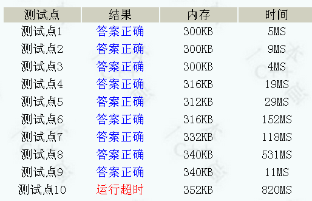
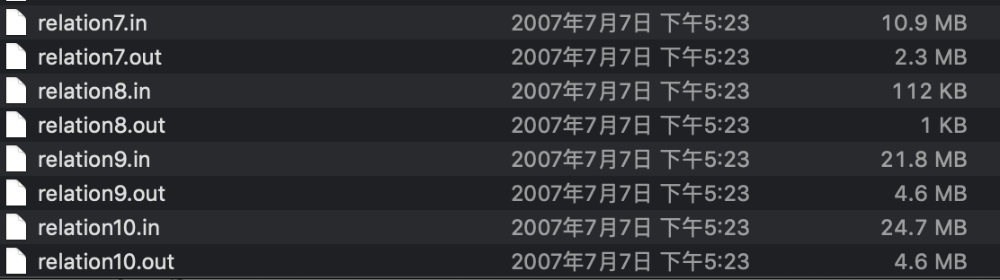
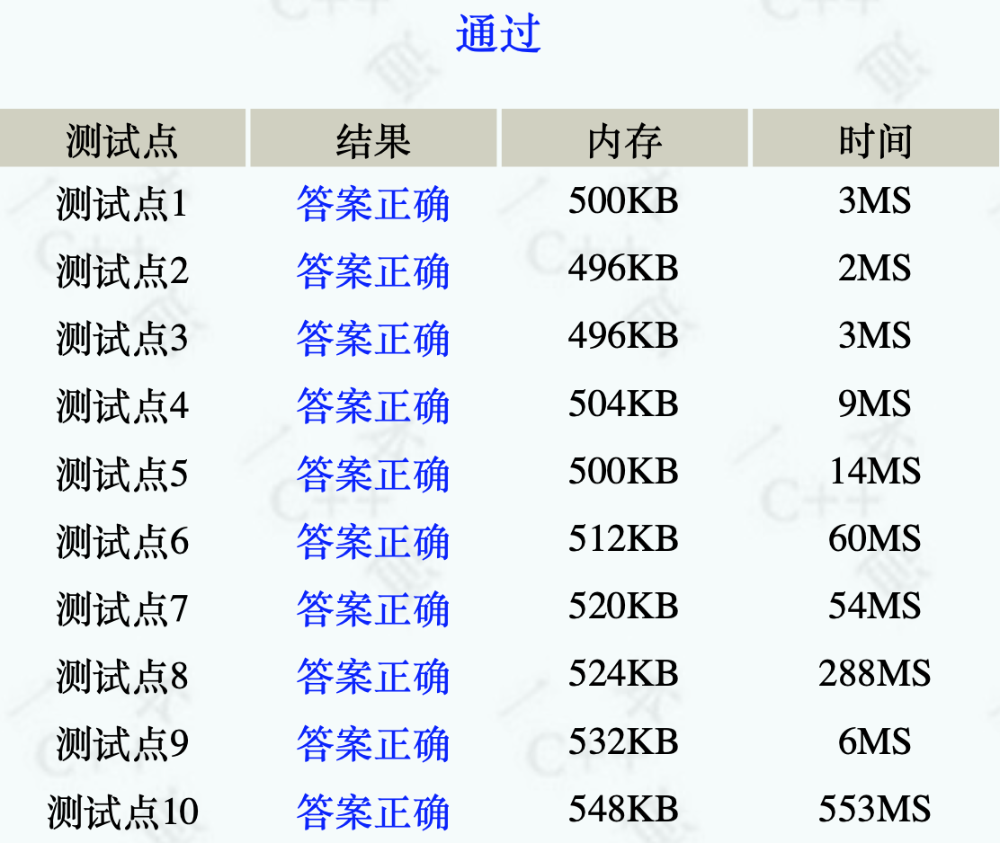

以一道题展开吧……

# [一本通P1346](http://ybt.ssoier.cn:8088/problem_show.php?pid=1346)

## 题目描述

或许你并不知道，你的某个朋友是你的亲戚。他可能是你的曾祖父的外公的女婿的外甥女的表姐的孙子。如果能得到完整的家谱，判断两个人是否是亲戚应该是可行的，但如果两个人的最近公共祖先与他们相隔好几代，使得家谱十分庞大，那么检验亲戚关系实非人力所能及。在这种情况下，最好的帮手就是计算机。为了将问题简化，你将得到一些亲戚关系的信息，如Marry和Tom是亲戚，Tom和Ben是亲戚，等等。从这些信息中，你可以推出Marry和Ben是亲戚。请写一个程序，对于我们的关于亲戚关系的提问，以最快的速度给出答案。

## 输入

输入由两部分组成。

第一部分以 $N,M$ 开始。$N$ 为问题涉及的人的个数( $1≤N≤20000$ )。这些人的编号为 $1,2,3,…,N$。下面有 $M$ 行( $1≤M≤1000000$ )，每行有两个数 $a_i,b_i$，表示已知 $a_i$ 和 $b_i$ 是亲戚。

第二部分以 $Q$ 开始。以下 $Q$ 行有 $Q$ 个询问( $1≤ Q ≤1000000$ )，每行为$c_i,d_i$，表示询问 $c_i$ 和 $d_i$ 是否为亲戚。

## 输出

对于每个询问 $c_i,d_i$，输出一行：若 $c_i$ 和 $d_i$ 为亲戚，则输出“Yes”，否则输出“No”。

## 输入样例

```
10 7
2 4
5 7
1 3
8 9
1 2
5 6
2 3
3
3 4
7 10
8 9
```

## 输出样例

```
Yes
No
Yes
```

## 标准代码

```c++
#include<cstdio>
#include<cstring>
#define MAXN 1000001
using namespace std;
int father[MAXN];
int n,m;
int find_father(int x){
    if(x!=father[x])
        father[x]=find_father(father[x]);
    return father[x];
}
void set_union(int x,int y){
    int x1=find_father(x);
    int y1=find_father(y);
    if(x1!=y1){
        father[y1]=x1;
    }
}

int main(){
    int a,b;
    scanf("%d%d",&n,&m);
    /*************初始化************/
    for(int i=1;i<=n;++i)
        father[i]=i;
    
    
    for(int i=1;i<=m;++i){
        scanf("%d%d",&a,&b);
        set_union(a,b);
    }
    int c,d,q;
    scanf("%d",&q);
    while(q--){
        scanf("%d%d",&c,&d);
        if(find_father(c)==find_father(d))
            printf("Yes\n");
        else printf("No\n");    
    }
    return 0;
}
```

测试结果如下：



我们来看一下测试数据：



二十多mb的数据，`scanf()`哭死了，于是我又开启了我的[**输入优化**](https://sa1tycat.github.io/posts/fast-read/)之旅；
优化之后


