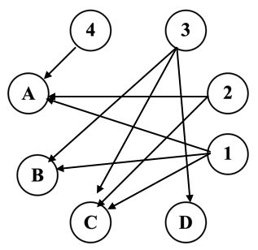

# [传送门](ybt.ssoier.cn:8088/problem_show.php?pid=1395)
~~没想到这道题竟然把我绕晕了，晕~~

# 题目

>问题描述
>
李教授将于今天下午作一次非常重要的演讲。不幸的是他不是一个非常爱整洁的人，他把自己演讲要用的幻灯片随便堆在一起。因此，演讲之前他不得不去整理这些幻灯片。做为一个讲求效率的学者，他希望尽可能简单地完成它。教授这次演讲一共要用n张幻灯片（n≤26），这n张幻灯片按照演讲要使用的顺序已经用数字1，2，…，n在上面编了号。因为幻灯片是透明的，所以我们用大写字母A，B，C，…再次把幻灯片依次编号。你的任务是编写一个程序，把幻灯片的数字编号和字母编号对应起来，显然这种对应应该是唯一的；若是出现多种对应的情况或是某些数字编号和字母编号对应不起来，我们就称对应是无法实现的。
>
输入文件（slides.in）
>
文件的第1行只有一个整数n，表示有n张幻灯片，接下来的n行每行包括4个整数Xmin，Xmax，Ymin，Ymax（整数之间用空格分开）为幻灯片的坐标，这n张幻灯片按其在输入文件中出现的顺序从前到后依次编号为A，B，C，…，再接下来的n行依次为n个数字编号的坐标x，y，显然在幻灯片之外是不会有数字的。
>
输出文件（slides.out）
>
若是对应可以实现，则输出文件包括n行，每一行一个字母和一个数字，中间一个空格，各行以字母的升序排列；若是对应无法实现，在文件的第一行顶格输出None即可。
>
样例输入
>
4
6 22 10 20
4 18 6 16
8 20 2 18
10 24 4 8
9 15
19 17
11 7
21 11
>
样例输出
>
A 4
B 1
C 2
D 3


# 分析

首先翻译一下题面：

先给你幻灯片张数，每张幻灯片都已知一个范围，且每个范围根据输入顺序分别记录为A、B、C...然后再给你具体坐标，坐标分别标号为1、2、3...，要你求这些坐标分别属于哪一个范围。
根据上述翻译我们把输入样例分析一下后，就有：



也就是：

$$1 \in{} A,B,C$$
$$2 \in{} A,C$$
$$3 \in{} B,C,D$$
$$4 \in{} A$$

以A-4开始逐渐消去，便可得到答案，具体实现请看下面代码

# Code

中间有很多注释掉的语句是调试时用的，有兴趣的同学可以去掉注释输出来看便于理解每个语句的作用

```c++
#include <cstdio>
#include <iostream>
#include <cmath>
#include <cstring>
#include <algorithm>
#include <queue>
#define MAXN 30
using namespace std;
struct node{
    int x1,x2,y1,y2;
}letter[MAXN];
struct nodee{
    int x,y;
}number[MAXN];
int n;
int out[MAXN],path[MAXN],e[MAXN][MAXN];
queue <int> q;
bool judge(int n,int l){ // judge whether num n points to letter l
    return number[n].x>=letter[l].x1 && number[n].x<=letter[l].x2 && number[n].y>=letter[l].y1 && number[n].y<=letter[l].y2;
}

int main(){
    cin>>n;
    // initialization
    for(int i=1;i<=n;++i){
        out[i]=0;
    }
    for(int i=1;i<=n;++i){
        for(int j=1;j<=n;++j){
            e[i][j]=0;
        }
    }


    for(int i=1;i<=n;++i){
        cin>>letter[i].x1>>letter[i].x2>>letter[i].y1>>letter[i].y2;
    }
    for(int i=1;i<=n;++i){
        cin>>number[i].x>>number[i].y;
    }


    for(int i=1;i<=n;++i){ // for letter
        for(int j=1;j<=n;++j){ // for number
            if(judge(j,i)){
                // build an edge, number points to letter
                e[j][i]=1;
//              printf("%c %d\n",i+64,j);
                out[j]++; // number's outdegree ++
            }
        }
    }
    for(int i=1;i<=n;++i){
        if(out[i]==1){
//          printf("%d\n",i);
            q.push(i);
        }
    }
    int s=0;
    while(!q.empty()){
        int v=q.front(); q.pop();
        s++;
        int u; // letter
        for(int i=1;i<=n;++i){ // record the path
            if(e[v][i]){
                path[i]=v;
//              printf("%c %d\n",i+64,v);
                u=i;
            }
        }
        for(int i=1;i<=n;++i){
            if(e[i][u]){
                out[i]--; // number's outdegree, i is a number
                if(out[i]==1) q.push(i); 
                e[i][u]=0; // delete
            }
        }
    }
    if(s<n){ // there's a circle
        cout<<"None"<<endl;
        return 0;
    }
    for(int i=1;i<=s;++i)
        printf("%c %d\n",i+64,path[i]);
    return 0;
}
```